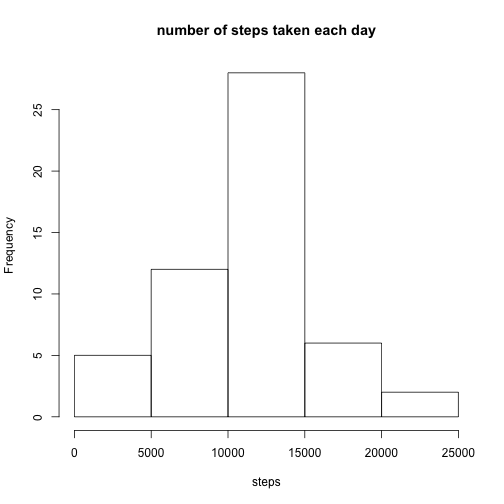
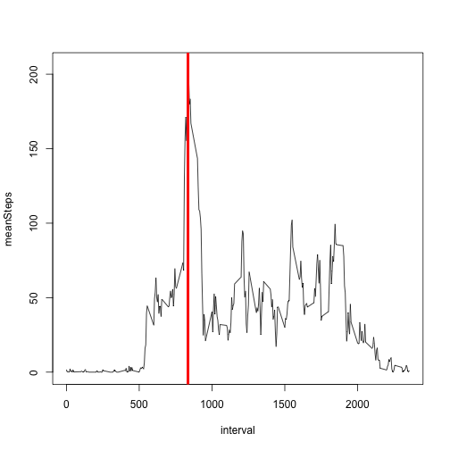
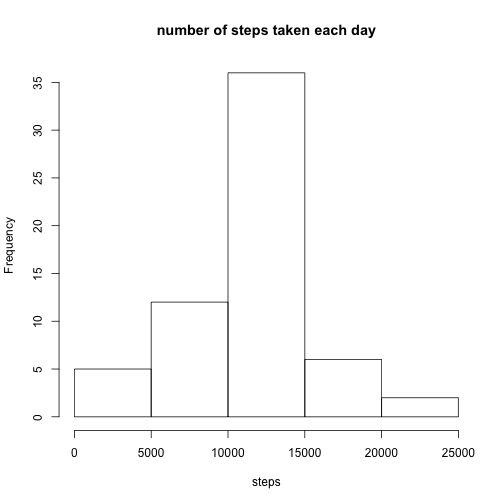
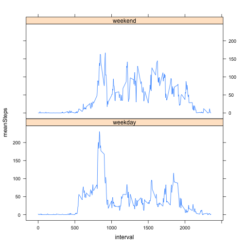

### Loading and preprocessing the data


```r
library(dplyr)
data <- read.csv("activity.csv", na.strings = "NA", stringsAsFactors = FALSE)
data$date <- as.Date(data$date)
```

### What is mean total number of steps taken per day?

1. Calculate the total number of steps taken per day


```r
data1 <- data %>% group_by(date) %>% summarise(total=sum(steps))
```

2. Make a histogram of the total number of steps taken each day


```r
hist(data1$total, main="number of steps taken each day", xlab="steps")
```

 

3. Calculate and report the mean and median of the total number of steps taken per day


```r
meanSteps <- mean(data1$total, na.rm=TRUE)
medianSteps <- median(data1$total, na.rm=TRUE)
```

As results we obtain:

* The mean number of steps (meanSteps): 10766.19
* The median number of stepts (medianSteps): 10765

### What is the average daily activity pattern?


```r
data2 <- data %>% group_by(interval) %>% summarise(meanSteps=mean(steps, na.rm=TRUE))
plot(data2, type="l")
maxInterval <- data2[which.max(data2$meanSteps), "interval"]
abline (v = maxInterval, col=2, lwd=4)
```

 

The 5-minute interval, on average across all the days in the dataset, that contains the maximum number of steps is 835

### Imputing missing values

1. Calculate and report the total number of missing values in the dataset (i.e. the total number of rows with NAs)


```r
dataNA <- apply(data, 1, function(x){any(is.na(x))})
totalNA <- sum(dataNA)
```

The total number of rows with missing values (totalNA) is 2304

2. Devise a strategy for filling in all of the missing values in the dataset.

To replace NA step values we will use the rounded mean of its 5-minute interval


```r
data3 <- data

for (i in which(is.na(data3$steps))) 
{
    data3[i, "steps"] <- unlist(data2[data2$interval == data3[i, "interval"], "meanSteps"])
}
```

Histogram of the total number of steps taken each day (dataset with NA replaced)


```r
data4 <- data3 %>% group_by(date) %>% summarise(total=sum(steps))
hist(data4$total, main="number of steps taken each day", xlab="steps")
```

 

We calculate the mean and median of total number of steps taken per day (dataset with NA replaced)


```r
meanStepsNoNA <- mean(data4$total, na.rm=TRUE)
medianStepsNoNA <- median(data4$total, na.rm=TRUE)
```

As results we obtain:

* The mean number of steps (meanStepsNoNA): 10766.19
* The median number of stepts (medianStepsNoNA): 10766.19


These values are quite similar to the obtained in the first part of the assigment, so our selected imputing strategy keeps data profile. 

### Are there differences in activity patterns between weekdays and weekends?


```r
# because my r studio is not in english by default
Sys.setlocale("LC_TIME", "en_US.UTF-8")
```


```r
isWeekend <- grepl("Sat|Sun", weekdays(data3$date, abbreviate = TRUE))
data3$dayType <- as.factor(ifelse(isWeekend, "weekend", "weekday"))

dataType <- data3 %>% group_by(interval, dayType) %>% summarise(meanSteps=mean(steps, na.rm=TRUE))
```


```r
library(lattice)
xyplot(meanSteps ~ interval | dayType, data = dataType, type="l", layout = c(1, 2))
```

 

It looks like people start walking more and earlier on weekdays. The number of steps is more distributed along on weekends, and people activity ends later on weekends.

To generate the html file this code can be used:

```
library(knitr)
knit2html("PA1_template.Rmd")
```
